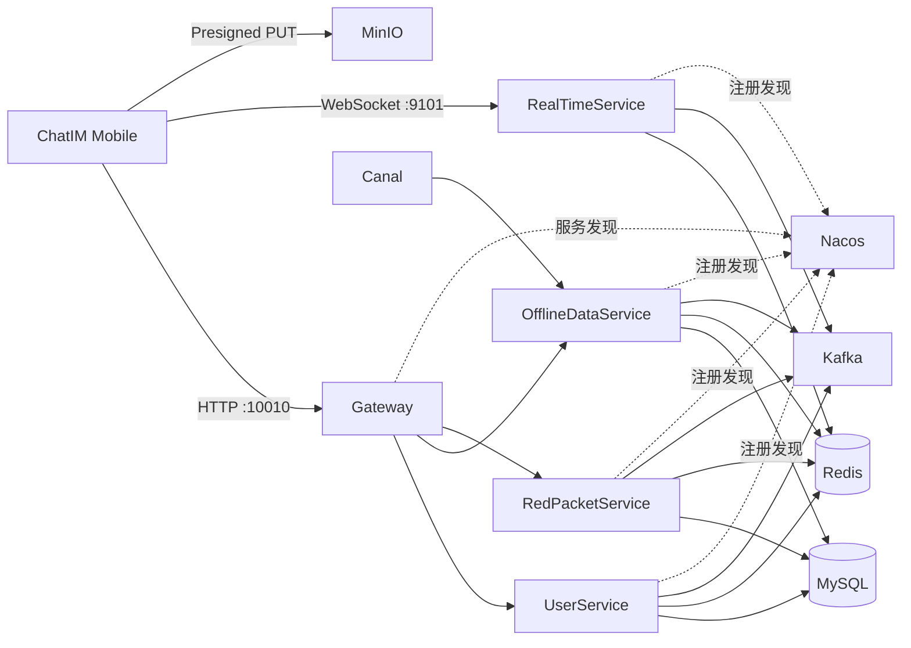

# ChatIM / InfinateChat

ChatIM 是一个正在迭代中的分布式即时通讯项目。仓库中的 Maven 工程名为 `InfinateChat`，产品界面名称为 `ChatIM`。

项目包含基于 Spring Boot 的微服务后端、Netty WebSocket 实时通信、Kafka 消息链路、Redis 在线路由、MySQL 消息与业务数据、MinIO 图片上传，以及一个可直接运行的移动端交互原型。

> 当前版本适合本地开发、产品演示和接口联调。可靠消息 ACK、发送幂等、结果查询、服务端离线同步游标、会话摘要、会话详情、已读位置、服务端未读数、群成员分页和群资料修改已经接入；群成员管理仍在下一轮计划中。

## 当前能力

### 账号与关系链

- 密码登录、验证码登录、注册、刷新令牌和退出登录。
- 好友搜索、好友申请、接受、拒绝和联系人列表。
- 群聊创建、成员邀请、服务端群资料、签名游标成员分页，以及按角色修改群名称、公告和头像。

### 消息与会话

- 单聊和群聊文本消息。
- 图片校验、压缩、预签名上传、图片气泡和全屏预览。
- WebSocket 心跳、断线检测和指数退避重连。
- 实时消息按 `clientMessageId` 归并，离线和历史消息按 `messageId` 去重。
- 基于账号签名游标的离线消息分页同步，完整数据回源 MySQL。
- 历史消息分页入口。
- 服务端会话摘要、置顶/免打扰状态、最后消息和未读数聚合。
- 会话详情返回单聊对方资料或群资料、当前用户权限和会话设置。
- 进入会话后提交单调递增的已读位置，冷启动和重连时以后端未读数校正本地状态。
- 会话草稿、最近消息和本地缓存恢复。

### 分布式基础能力

- Gateway 统一业务 HTTP 入口。
- Nacos 服务注册与发现。
- RealTimeService 多实例 WebSocket 路由。
- Redis 保存登录态、在线路由和热点数据。
- Kafka 连接实时推送与消息存储链路。
- RedPacketService 提供红包相关业务能力。

### 移动端原型

- iPhone 和 Pixel 10 两套设备预览。
- 登录、会话、联系人、群聊、图片消息、发现和个人中心页面。
- 键盘、安全区、加载、空状态和失败状态适配。
- `?demo=1` 可在没有后端服务时体验主要流程。

## 架构概览



## 仓库结构

| 目录 | 说明 | 默认端口 |
|---|---|---:|
| `Gateway` | HTTP 网关、路由和跨域配置 | 10010 |
| `UserService` | 用户、登录、好友、群聊和上传地址 | 8104 |
| `OfflineDataService` | 消息持久化、历史消息和离线消息 | 8101 |
| `RealTimeService` | 实时消息、WebSocket 连接和跨实例推送 | HTTP 8102 / Netty 9101 |
| `RedPacketService` | 红包发送、领取和过期处理 | 8103 |
| `Common` | 公共模型、响应结构、常量和工具 | — |
| `ChatIMMobile` | React + Vite 移动端产品原型 | 4173 |

## 技术栈

### 后端

- Java 17
- Spring Boot 3.5
- Spring Cloud Gateway
- Spring Cloud Alibaba Nacos
- Spring Kafka
- Spring Data Redis
- MyBatis-Plus
- Netty WebSocket
- OpenFeign
- MySQL
- MinIO
- Canal
- ShedLock

### 前端原型

- React 19
- TypeScript
- Vite
- Radix UI Icons
- Playwright

## 环境要求

本地启动真实后端前，需要准备：

- JDK 17；
- Maven 3.9 或兼容版本；
- Node.js 20 或更高版本；
- MySQL 8；
- Redis；
- Kafka；
- Nacos；
- MinIO；
- Canal，只有需要验证当前热数据同步链路时才必须启动；
- SMTP 账号，只有需要发送真实邮箱验证码时才必须配置。

默认基础设施地址：

| 依赖 | 默认地址或端口 |
|---|---|
| MySQL | `localhost:3306/InfiniteChat` |
| Redis | `127.0.0.1:6379`，database 2 |
| Kafka | `localhost:9092` |
| Nacos | `localhost:18375` |
| MinIO | `http://localhost:9000` |
| Canal | `localhost:11111` |

仓库目前没有 Docker Compose 和完整的基线建表脚本。启动真实服务前，需要先准备 `InfiniteChat` 数据库及项目所需表结构，并按顺序执行 `database/migrations` 下的增量脚本。不要在未确认数据结构的情况下直接连接生产数据库。

当前版本部署前必须确认以下迁移已经执行：

1. `20260926_message_delivery_idempotency.sql`：增加 `client_message_id` 及发送者幂等唯一索引；
2. `20260926_message_sync_cursor.sql`：增加离线同步所需的会话联合游标索引；
3. `20260926_session_read_state.sql`：增加已读位置、置顶、免打扰、隐藏状态和会话列表索引；
4. `20260926_group_member_pagination.sql`：增加群成员角色、加入时间和用户 ID 联合分页索引；
5. `20260926_group_profile.sql`：增加群头像稳定对象标识和群公告字段。

## 配置

各服务的 `src/main/resources/application.example.yml` 是可公开的配置参考。推荐通过环境变量注入真实配置，不要把密码、访问密钥或邮件授权码提交到仓库。

常用环境变量：

```powershell
$env:MYSQL_HOST="localhost"
$env:MYSQL_PORT="3306"
$env:MYSQL_DATABASE="InfiniteChat"
$env:MYSQL_USERNAME="root"
$env:MYSQL_PASSWORD="your-password"

$env:REDIS_HOST="127.0.0.1"
$env:REDIS_PORT="6379"
$env:REDIS_DATABASE="2"
$env:REDIS_PASSWORD=""

$env:KAFKA_BOOTSTRAP_SERVERS="localhost:9092"
$env:NACOS_SERVER_ADDR="localhost:18375"
$env:CANAL_ENABLED="true"

$env:MINIO_URL="http://localhost:9000"
$env:MINIO_ACCESS_KEY="your-access-key"
$env:MINIO_SECRET_KEY="your-secret-key"

$env:MAIL_HOST="smtp.qq.com"
$env:MAIL_PORT="587"
$env:MAIL_USERNAME="your-email"
$env:MAIL_PASSWORD="your-mail-app-password"

$env:FRONTEND_ORIGIN="http://localhost:4173"
```

多实例运行 RealTimeService 时，每个实例需要使用不同配置：

```powershell
$env:SERVER_PORT="8102"
$env:NETTY_SERVER_PORT="9101"
$env:REALTIME_INSTANCE_ID="realtime-9101"
$env:SNOWFLAKE_WORKER_ID="1"
$env:SNOWFLAKE_DATACENTER_ID="1"
```

同一环境中的 Snowflake `workerId + datacenterId` 组合不能重复。

## 构建后端

在仓库根目录执行：

```powershell
mvn clean install
```

跳过测试构建：

```powershell
mvn clean package -DskipTests
```

## 启动后端

先启动 MySQL、Redis、Kafka、Nacos 和 MinIO，再分别打开终端启动服务。推荐顺序如下：

```powershell
mvn -f UserService/pom.xml spring-boot:run
mvn -f OfflineDataService/pom.xml spring-boot:run
mvn -f RealTimeService/pom.xml spring-boot:run
mvn -f RedPacketService/pom.xml spring-boot:run
mvn -f Gateway/pom.xml spring-boot:run
```

服务启动后，业务 HTTP 请求统一访问：

```text
http://localhost:10010
```

WebSocket 地址由登录响应中的 `nettyUri` 提供，客户端连接路径为：

```text
/ws/netty
```

不要在客户端固定写死某个 RealTimeService 实例地址。

## 启动移动端原型

进入前端目录并安装依赖：

```powershell
cd ChatIMMobile
npm install
```

启动开发服务器：

```powershell
npm run dev -- --host 0.0.0.0 --port 4173
```

真实接口模式：

```text
http://localhost:4173/
```

无需后端的演示模式：

```text
http://localhost:4173/?demo=1
```

演示模式可以使用任意格式正确的邮箱，密码和验证码均为：

```text
123456
```

如需修改 Gateway 地址，将 `.env.example` 复制为 `.env.local`：

```dotenv
VITE_API_BASE_URL=http://localhost:10010
VITE_DEMO_MODE=false
```

## 测试与检查

### 后端

```powershell
mvn test
```

上下文测试会关闭 `OfflineDataService` 的 Canal 客户端和 `RealTimeService` 的 Redis 跨实例订阅，因此执行 `mvn test` 不要求启动这两项外部连接。开发环境如暂时不验证 Redis 热数据同步，可设置 `CANAL_ENABLED=false`；部署环境默认启用完整链路。

### 前端

```powershell
cd ChatIMMobile
npx playwright install chromium
npm run check:runtime
npm run build
npm run test:runtime
npm run test:sites
```

首次运行 Playwright 前需要安装与项目版本匹配的 Chromium。`check:runtime` 用于确认移动设备框架、状态栏、键盘和安全区等受保护运行时文件没有被意外修改；`test:runtime` 验证滑动、键盘、安全区、BottomSheet 和页面栈交互；`test:sites` 验证静态资源与单页路由回退。

## 主要接口

HTTP 请求通过 Gateway 的 `http://localhost:10010` 访问。

| 能力 | 路径 |
|---|---|
| 用户与登录 | `/api/user/**` |
| 好友与联系人 | `/api/contact/**` |
| 群聊 | `/api/group/**` |
| 会话摘要 | `GET /api/session/list` |
| 会话详情 | `GET /api/session/{sessionId}` |
| 标记会话已读 | `POST /api/session/{sessionId}/read` |
| 群成员分页 | `GET /api/group/{sessionId}/members` |
| 离线与历史消息 | `/api/message/**` |
| 各会话未读数 | `GET /api/message/unread` |
| 消息发送结果 | `GET /api/message/status?clientMessageId=` |
| 红包 | `/api/chat/redPacket/**` |
| 浏览器 WebSocket ticket | `POST /api/user/ws-ticket` |
| WebSocket | `/ws/netty`，当前直连 RealTimeService |

HTTP 接口推荐使用标准 Bearer 认证，同时兼容现有 `Access-Token` 请求头：

```text
Authorization: Bearer <accessToken>
Refresh-Token: <refreshToken>
```

移动端原生 WebSocket 握手使用：

```text
Authorization: Bearer <accessToken>
```

标准浏览器先通过已登录的 HTTP 请求调用 `POST /api/user/ws-ticket`，再使用返回的 `nettyUri?ticket=<一次性凭证>` 建立连接。ticket 最长有效 60 秒、仅可消费一次，并绑定当前 accessToken 和目标实时服务；长期 accessToken 和 refreshToken 不进入 WebSocket URL。服务端暂时兼容旧客户端的纯 token `Authorization` 写法。

## 消息链路

普通消息的主要流向：

```text
客户端 WebSocket
  -> RealTimeService 绑定已认证发送者、校验会话权限并按 clientMessageId 幂等
  -> WebSocket accepted ACK
  -> Kafka 存储 Topic
  -> OfflineDataService 持久化
  -> Kafka persisted ACK -> 发送者 WebSocket
  -> Kafka 推送 Topic
  -> RealTimeService 查询 Redis 在线路由
  -> 本机推送或跨实例转发
```

客户端需要同时处理：

- WebSocket 实时消息；
- `/api/message/offline/sync` 游标分页离线同步；
- `/api/message/history` 历史消息；
- 使用 `messageId` 去重；
- 使用 `clientMessageId` 归并本地待发送消息。

发送者收到 `accepted` 时消息仍显示“发送中”，收到 `persisted` 后才显示“已发送”。ACK 丢失或超时时，客户端通过 `/api/message/status` 查询 `accepted`、`persisted`、`failed` 或 `notFound`，不会把普通实时回推误认为落库成功。

离线同步使用服务端签名且绑定账号的联合游标，以 `createdTime + messageId` 稳定翻页。MySQL 是完整数据源，客户端每页合并成功后才保存 `nextCursor`，Redis 热数据缺失不会造成同步遗漏。

## 当前限制

- 会话摘要、详情、已读位置和未读数已经由服务端提供；置顶、免打扰、隐藏等写操作接口尚未补齐。
- 群资料、成员分页以及群名称、公告、头像修改已经接入；角色管理、退出、移除和解散接口尚未实现。
- 图片消息需要从长期下载 URL 调整为稳定对象标识。
- 浏览器原型使用 `localStorage`，正式移动端必须迁移到系统安全存储和本地数据库。
- 系统通知暂未形成独立的存储和历史查询闭环。
- 完整基线建表、自动迁移、基础设施编排和一键启动脚本尚未纳入仓库。

## 安全注意事项

- 不要提交真实数据库密码、Redis 密码、MinIO 密钥、邮件授权码或 JWT。
- 不要在日志中输出 token、WebSocket ticket 或预签名上传 URL。
- HTTP 操作者必须由 JWT 确定，不能信任请求体里的 `userId` 或 `senderId`。
- WebSocket 服务必须校验已认证用户与会话成员关系。
- 生产环境使用 HTTPS、WSS 和外部可达的对象存储地址。
- 红包等资金类操作必须由服务端完成幂等、权限校验和最终状态确认。

## 项目文档

- [前端产品需求](./FRONTEND_PRODUCT_REQUIREMENTS.md)
- [下一轮产品与联调需求](./NEXT_ROUND_PRODUCT_REQUIREMENTS.md)
- [分布式加固实施计划](./DISTRIBUTED_HARDENING_IMPLEMENTATION_PLAN.md)
- [项目学习总结](./PROJECT_LEARNING_SUMMARY.md)
- [移动端原型说明](./ChatIMMobile/README.md)
- [移动端视觉与交互验收记录](./ChatIMMobile/design-qa.md)

## 下一轮重点

下一轮按以下顺序推进：

1. 群成员退出、移除、角色管理、转让和解散。
2. 会话置顶、免打扰和隐藏操作。
3. 图片稳定对象标识与临时下载地址。
4. 移动端安全存储。
5. 消息手动重试和红包主流程。

完整范围和验收条件见 [NEXT_ROUND_PRODUCT_REQUIREMENTS.md](./NEXT_ROUND_PRODUCT_REQUIREMENTS.md)。
